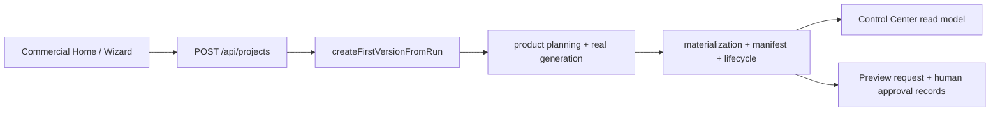

# ORQUESTADOR — Escalón 11A: auditoría de integración end-to-end

## Estado canónico

`ESCALON_11_STATUS=IN_PROGRESS`
`ESCALON_11A_STATUS=COMPLETED`
`ESCALON_11B_STATUS=NOT_STARTED`
`ESCALON_11C_STATUS=NOT_STARTED`
`ESCALON_11D_STATUS=NOT_STARTED`
`NEXT=ESCALON_11B_CANONICAL_E2E_ORCHESTRATION`

Escalón 11A audita el recorrido real y sus costuras. No declara que todas las capas estén conectadas: distingue evidencia de código, evidencia de smoke, recorrido comercial real y stacks paralelos.

## Alcance y evidencia

La prueba controlada ejecuta el servidor Web real sobre un root temporal, sin providers ni red externa. El browser test usa Chromium headless, workers=1, y recorre Home → wizard → creación de proyecto → Workspace/Control Center → Preview → Operation.

Artefactos:

- `.codex-temp/escalon-11a/integration-audit.json`
- `.codex-temp/escalon-11a/evidence/01-home.png`
- `.codex-temp/escalon-11a/evidence/03-project-created.png`
- `.codex-temp/escalon-11a/evidence/04-workspace.png`
- `.codex-temp/escalon-11a/evidence/07-operation.png`

El bug encontrado durante la auditoría fue corregido y cubierto: un nombre comercial que comenzaba con un número generaba un `projectId` inválido. Ahora se antepone `proyecto-` y el smoke comercial lo verifica.

## Flujo canónico esperado

```mermaid
flowchart LR
  U[User] --> I[Intake]
  I --> D[Discovery]
  D --> R[Research]
  R --> E[Evidence Gate]
  E --> P[Planner]
  P --> G[Planner Gate]
  G --> X[Controlled Execution]
  X --> M[Materialization]
  M --> Q[Canonical QA]
  Q --> V[Preview]
  V --> H[Human Gate]
  H --> C[Correction / Re-QA]
  H --> L[Local Delivery]
  L --> F[Release Request]
  F --> Git[Git Execution]
  Git --> CI[Remote CI]
  CI --> FG[Release Gate]
  FG --> O[Observability]
  O --> CC[Control Center]
```

## Flujo realmente verificado

El recorrido comercial real no crea intake, discovery, research plan, evidence case, planner request/plan/gate, controlled execution, QA run canónico, release request/flow ni observability snapshot. Es una ruta real y útil, pero parcial.

## Identidad y lineage observado

| Campo | Evidencia 11A |
|---|---|
| projectId | `e2e-audit-project` |
| runId | `e2e-audit-run` |
| versionId | `e2e-audit-version` |
| previewRequestId | generado y persistido |
| intake/discovery/research/evidence | `NOT_CREATED` |
| planner/gate/execution/result | `NOT_CREATED` |
| qa/review/approval | `NOT_CREATED` para la cadena canónica; preview approval físico sí fue creado |
| delivery/release/observability | `NOT_CREATED` en el recorrido comercial |

La continuidad de proyecto/run/version y el retorno de las APIs fueron verificados. La correlación completa del flujo canónico no puede declararse porque sus identificadores upstream/downstream no fueron creados.

## Call graph real

`Commercial UI → runtimeClient → jefe-web-server POST /api/projects → jefe-project-creation.createFirstVersionFromRun → normalizeRequest → jefe-real-generation.materializeProject + jefe-product-planning.createProductPlanning → persistence.registerManifest → lifecycle.ensureCreated`.

Registros físicos observados en el root aislado: índice de proyecto, ledger de eventos, manifest, planning, app/assets/data/docs generados y registros de preview/approval.

## Matriz de costuras

| Costura | Estado | Lectura honesta |
|---|---|---|
| Commercial → Context | `CONNECTED_REAL_PARTIAL` | IDs comerciales y read models reales |
| Commercial → Discovery | `BYPASSED` | el POST normal no invoca discovery |
| Discovery → Research | `CONNECTED_VIA_ADAPTER` | conexión existente en el stack especializado |
| Research → Evidence Gate → Planner → Planner Gate | `CONNECTED_REAL` | verificado por código/smokes del stack |
| Planner Gate → Execution | `CONNECTED_REAL` | stack canónico existente |
| Execution → Materialization | `TEST_ONLY` | no probado como costura del POST comercial |
| Materialization → QA | `NOT_CONNECTED` | no se crea QA canónico durante create |
| QA → Preview | `CONNECTED_REAL_PARTIAL` | preview existe, pero no está ligado a QA canónico |
| Preview → Human Gate | `CONNECTED_REAL` | preview/approval durable |
| Rejection → Correction → QA | `CONNECTED_REAL_PARTIAL / PARALLEL_STACK` | corrección existe, reentrada canónica no demostrada |
| Human Approval → Local Delivery | `CONNECTED_REAL` | capa local existente |
| Local Delivery → Release Request | `NOT_CONNECTED` | no nace release flow del recorrido comercial |
| Release → Git → Remote CI → Release Gate | `CONNECTED_REAL` | integración 8C interna, no iniciada por este POST |
| Release → Observability → Control Center | `CONNECTED_REAL` | integración existente/read-only |
| Observability → Memory | `NOT_CONNECTED` | limitación documentada previamente |

`jefe-product-planning` es planificación comercial usada por materialización; no es automáticamente el `Planner` canónico. Los dos recorridos se clasifican como `PARALLEL_STACK`. Del mismo modo, la generación real sí materializa artefactos, pero la costura desde `Controlled Execution` canónico queda `TEST_ONLY` en esta auditoría.

## Hallazgos

- `P0=0`: no se encontró mutación remota, pérdida de autoridad, secreto, producción ni bypass de aprobación humana.
- `P1`: la creación comercial bypassa Discovery/Research/Evidence/Planner/Controlled Execution sin una decisión de routing durable y explícita.
- `P1`: la materialización normal no crea el QA canónico ni enlaza su evidencia al preview.
- `P1`: la entrega local no crea un release request/flow; el subsistema de release fue demostrado de forma independiente en 8C.
- `P1`: el POST comercial no produce snapshot de observabilidad propio; el Control Center lee lo disponible y mantiene unknown/not-started cuando falta evidencia.
- `P2`: la corrección semántica y la reentrada a QA aparecen en superficies paralelas; la continuidad end-to-end no está probada.

La política de bypass no se infiere por ausencia: queda como decisión pendiente para 11B. El siguiente escalón debe elegir routing condicional explícito o conectar las capas, conservando identidad, evidencia y gates.

## Autoridad y seguridad

La auditoría mantuvo `ProviderCalls=0`, `ExternalNetworkUsed=false`, `PRODUCTION_READY=false`, `RELEASE_READINESS=BLOCKED` y `HistoricalLintErrors=306`. No se ejecutaron release, deploy, PR, merge, tag ni mutaciones GitHub. La aprobación humana no se convierte en incidente ni se presume por la existencia del preview.

## Plan derivado

### 11B — `ESCALON_11B_CANONICAL_E2E_ORCHESTRATION`

Definir e implementar el envelope de identidad/correlación y el orquestador que conecte el recorrido comercial con routing explícito hacia discovery, research, planner, execution y QA. Cada bypass debe quedar como política durable y observable; no alcanza con documentación.

### 11C — `ESCALON_11C_REAL_END_TO_END_ACCEPTANCE`

Aceptar un flujo completo real con QA, Human Gate, delivery, release gating y observabilidad/control center conectados; conservar providers simulados o autorizados según el alcance posterior.

### 11D — `ESCALON_11D_E2E_RECOVERY_AND_CLOSURE`

Probar restart, crash, replay, stale, corrección y cierre completo del flujo conectado.

Esta auditoría no cierra Escalón 11 ni altera la deuda histórica de calidad.

## 11B — Canonical E2E Orchestration

11B agrega una autoridad durable sin fusionar artificialmente los subsistemas existentes:

`Commercial Request → E2E Flow → immutable Routing Decision → Discovery → conditional Research/Evidence → Product Planning → local Materialization → artifact QA → Preview → Human Gate → Delivery boundary → Release boundary → operational read model`.

### Contratos y persistencia

- `jefe-e2e-flow/v1` declara siempre las etapas `context`, `discovery`, `research`, `evidence`, `planning`, `execution`, `qa`, `preview`, `human_gate`, `delivery`, `release`, `observability` y `memory`.
- Cada etapa tiene `mode`, `requirement`, `status`, `reasonCode`, `inputRefs` y `outputRefs`; un bypass es `skipped_by_policy` con razón durable.
- `jefe-e2e-routing-policy/v1` es trusted, determinista e inmutable. El renderer no decide skips, QA ni release.
- `.jefe-e2e/flows`, `routing` y `receipts` usan escrituras atómicas, identidad determinista y CAS/revision.
- El manifest recibe metadata aditiva `jefe-e2e-lineage/v1` con flow, route, planning, execution y QA refs.

### Routing actual

Para un sitio comercial con brief de primera parte suficiente: Discovery se ejecuta realmente; Research y Evidence se `skipped_by_policy` por `FIRST_PARTY_INPUT_SUFFICIENT`/`REFERENCE_AS_INPUT`; Product Planning gobierna la materialización; Execution usa `local_materialization`; QA usa `semantic_artifact_quality`; Preview sólo se crea después de QA; Human Gate queda `waiting`; Delivery y Release permanecen en fronteras explícitas.

Si una política trusted exige Research, el flow queda `blocked` en Research/Evidence sin provider, sin fabricar evidencia y sin materializar. La generación determinista no se disfraza de Codex execution y `jefe-planner-*` no se declara equivalente a `jefe-product-planning`.

### QA, Human Gate y límites

La evidencia QA durable está ligada a `e2eFlowId`, identidad exacta, execution receipt y manifest. Un fallo QA bloquea Preview y Human Gate. La aprobación humana continúa siendo la única autoridad de aprobación; QA no entrega ni libera automáticamente. Delivery es una acción posterior explícita y Release sigue requiriendo request/autorización del subsistema 8B/8C. No se ejecuta ninguna mutación remota.

El Web POST y el create inicial IPC usan el mismo orquestador; la materialización existente queda detrás de un adapter estrecho. Control Center incorpora el resumen del flow como read model, no como autoridad mutante. La persistencia de MEMORIA no se fuerza: el stage queda explícitamente `skipped_by_policy` cuando no hay milestone-memory configurado.

### Evidencia 11B

`scripts/jefe-e2e-orchestration-smoke.mjs` cubre flujo simple, Discovery real, Research requerido/bloqueado, QA fail, replay, colisión, concurrencia, aislamiento y routing tamper. El flujo simple termina en `human_gate=waiting` con refs de intake, planning, execution receipt, QA evidence y preview. `ProviderCalls=0`, `ExternalNetworkUsed=false`, `RELEASE_READINESS=BLOCKED` y `PRODUCTION_READY=false`.

P1-1, P1-2 y P1-4 de 11A quedan cerrados estructuralmente para la creación inicial. La ruta de requested-change/correction completa, delivery real y release request siguen siendo límites para 11C/11D; no se declaran cerrados por la existencia de null refs.
